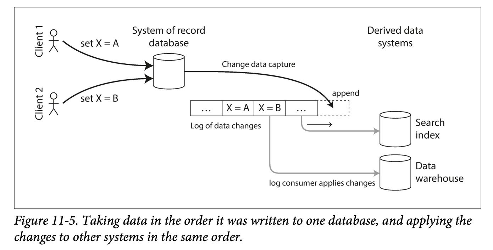

10장의 배치 처리는 입력 데이터가 유한하다고 가정한다. 하지만 현실에서 데이터는 끝없이 흘러들어온다.

배치 처리는 인위적으로 일정 기간씩 데이터 청크를 나눠야 한다. 경계를 그어 "어제 하루치 데이터"처럼 묶는 것이다. 스트림 처리는 이 경계를 없애고, 데이터가 도착하는 즉시 처리하는 방식이다.

# 1. 이벤트 스트림 전송

- **이벤트(event)** 란 어느 시점에 일어난 일을 기록한 작은 불변 객체다. 특정 사용자의 액션, 센서 측정값, CPU 사용률 수치처럼 무언가 "발생했음"을 나타낸다.
- 이벤트는 생산자(producer, 발행자/송신자)가 생성하고, 소비자(consumer, 구독자/수신자)가 처리한다.
- 관련 이벤트들은 토픽(topic)이나 스트림으로 묶인다.

그렇다면 **생산자가 만든 이벤트를 소비자에게 어떻게 전달**할 것인가? 이 질문이 ‘이벤트 스트림 전송'의 핵심이다.

## 1-1. 메시징 시스템

> 알림을 구현하는 가장 단순한 방법은 생산자와 소비자를 직접 연결하는 것이다. 하지만 직접 연결에는 근본적인 한계가 있다. 이 한계를 극복하기 위해 메시지 브로커가 등장한다.

메시징 시스템을 설계할 때 두 가지 핵심 질문이 있다.

1. **생산자가 소비자보다 빠를 때** 어떻게 할 것인가? → 메시지를 버린다 / 큐에 버퍼링한다 / 배압(backpressure)으로 생산자를 늦춘다
2. **노드가 죽거나 일시적으로 오프라인이 되면** 어떻게 할 것인가? → 지속성(durability)을 위해 디스크에 쓰거나 복제하면 성능 비용이 생긴다

### 1-1-1. 생산자에서 소비자로 메시지를 직접 전달하기

중간 노드 없이 생산자가 소비자에게 직접 메시지를 보내는 방식들이다.

- **UDP 멀티캐스트**: 금융 업계의 주식 피드처럼 낮은 지연이 최우선일 때 쓴다. UDP는 패킷 손실을 허용하며, 애플리케이션 레이어에서 유실을 보정한다.
- **브로커 없는 메시지 라이브러리 (ZeroMQ, nanomsg)**: TCP나 IP 멀티캐스트 위에서 동작한다.
- **StatsD, Brubeck**: UDP로 네트워크 전반의 메트릭을 수집한다.
- **HTTP/RPC 웹훅**: 생산자가 소비자의 엔드포인트로 직접 HTTP 요청을 보낸다.

**직접 전달의 한계:** 소비자가 오프라인이거나 처리가 느리면 메시지가 유실될 수 있다. 또한 생산자가 소비자의 존재를 직접 알아야 하므로 결합도가 높아진다.

### 1-1-2. 메시지 브로커

> 직접 전달의 한계를 극복하기 위해 중간에 버퍼 역할을 하는 메시지 브로커(message broker, 메시지 큐)를 둔다.

**메시지 브로커(message broker)**: 메시지 스트림 처리에 최적화된 일종의 데이터베이스. 생산자는 브로커에 메시지를 쓰고, 소비자는 브로커에서 메시지를 읽는다.

**핵심 이점:**

- 생산자와 소비자가 분리된다. 소비자가 일시적으로 장애가 있어도 메시지가 보관된다.
- 소비자가 준비됐을 때 메시지를 꺼내가므로 내구성이 보장된다.
- 생산자는 소비자를 알 필요가 없다.

**예시:** RabbitMQ, ActiveMQ, Qpid, HornetQ, TIBCO, IBM MQ 등은 AMQP/JMS 표준을 구현한 전통적인 메시지 브로커다.

### 1-1-3. 메시지 브로커와 데이터베이스의 비교

브로커는 데이터베이스와 비슷해 보이지만 다음과 같이 다르다.

| 관점          | 메시지 브로커            | 데이터베이스            |
| ----------- | ------------------ | ----------------- |
| **데이터 보존**  | 소비자에게 전달되면 자동 삭제   | 명시적으로 삭제하기 전까지 유지 |
| **워킹 셋 크기** | 큐가 짧다고 가정 (메모리 상주) | 장기 대용량 저장 가능      |
| **쿼리 지원**   | 토픽 구독만 가능          | 임의의 쿼리 지원         |
| **색인 / 검색** | 지원 안 함             | 인덱스 등 풍부한 지원      |

> 이 차이는 단순한 특성 비교가 아니다. 브로커는 "**일회성 전달**"을 위해 설계됐고, 데이터베이스는 "**영속적 기록**"을 위해 설계됐다. 뒤에서 다룰 로그 기반 메시지 저장소는 이 경계를 의도적으로 허문다.

### 1-1-4. 복수 소비자

하나의 토픽을 여러 소비자가 읽을 때 두 가지 패턴이 있다.

**1. 로드 밸런싱 (경쟁 소비자, competing consumers)** 메시지 하나가 소비자 그룹 중 **하나에게만** 전달된다. 비용이 큰 메시지를 병렬로 처리할 때 적합하다.

- **예시:** 이메일 발송 작업이 큐에 쌓이면, Worker 1·2·3이 나눠서 처리한다.

**2. 팬아웃 (fan-out)** 메시지 하나가 **모든** 소비자에게 전달된다. 독립적인 여러 시스템이 동일한 이벤트를 각자 처리해야 할 때 적합하다.

- **예시:** "주문 완료" 이벤트 하나를 결제 시스템, 재고 시스템, 알림 시스템이 각각 독립적으로 수신한다.

두 패턴은 조합해서 사용할 수 있다.

### 1-1-5. 확인 응답과 재전송

> 소비자가 메시지를 받은 직후 죽으면 어떻게 될까? 브로커가 "전달 완료"로 표시했다면 메시지는 영영 유실된다. 이를 방지하기 위해 확인 응답(acknowledgment) 메커니즘이 있다.

**확인 응답(acknowledgment):** 소비자가 메시지를 완전히 처리한 후 브로커에 ack를 보낸다. 브로커는 ack를 받기 전까지 메시지를 삭제하지 않는다. 소비자가 ack 없이 죽으면 브로커는 메시지를 다른 소비자에게 재전송한다.

**메시지 순서 역전 문제:**

**예시:** 소비자 1이 메시지 m1을 처리하는 도중 죽는다. 그 사이 소비자 2는 m2를 성공적으로 처리했다. 브로커가 m1을 소비자 2에게 재전달하면 소비자 2 입장에서 처리 순서는 m2 → m1이 된다. 순서가 뒤바뀐 것이다.

이 순서 역전 문제는 로드 밸런싱과 재전송이 결합될 때 발생한다. **메시지 순서가 중요하다면, 하나의 소비자에게만 전달하거나 뒤에서 다룰 파티셔닝된 로그 방식을 써야 한다.**

## 1-2. 파티셔닝된 로그

> 전통적인 메시지 브로커는 확인 응답을 받으면 메세지를 삭제한다. 그런데 데이터베이스처럼 메시지를 영속적으로 보관한다면 어떨까? 이 발상에서 로그 기반 메시지 브로커가 탄생했다.

**로그 기반 메시지 브로커(log-based message broker)**: 생산자가 쓴 메시지를 영속적인 로그에 순서대로 저장하고, 소비자는 이 로그를 순서대로 읽는 방식.

- 대표 구현체: Apache Kafka, Amazon Kinesis Streams, Twitter의 DistributedLog.

### 1-2-1. 로그를 사용한 메시지 저장소

**로그(log):** 디스크에 레코드를 순서대로만 추가할 수 있는(append-only) 자료구조. 생산자는 로그 끝에 이벤트를 추가하고, 소비자는 로그를 순서대로 읽는다.

처리량을 높이기 위해 **로그를 여러 파티션(partition)으로 나눠** 여러 머신에 분산한다. 같은 종류의 메시지를 담는 파티션들의 묶음이 **토픽(topic)** 이다.

- 각 파티션 내부에서는 메시지 순서가 보장된다.
- 파티션 간에는 순서 보장이 없다.
- 브로커는 파티션 내 각 메시지에 단조 증가하는 **오프셋(offset)** 을 부여한다.

**예시:** Kafka는 초당 수백만 건의 메시지를 처리한다. 토픽을 50개 파티션으로 나누면 50대의 소비자 노드가 병렬로 읽을 수 있다.

### 1-2-2. 로그 방식과 전통적인 메시징 방식의 비교

> 파티셔닝된 로그에서도 당연히 팬 아웃 메시징 방식을 지원한다. 반면 로드 밸런싱 방식은 전통적인 브로커와 다르게 동작한다.

**팬아웃:** 여러 소비자 그룹이 같은 로그를 독립적으로 읽으면 된다. 소비자가 로그를 읽어도 메시지가 사라지지 않으므로, 서로 간섭 없이 각자의 속도로 처리한다.

**로드 밸런싱:** 파티션 전체를 소비자 그룹 내 한 노드에 할당한다 (메시지 단위가 아니라 파티션 단위 배분).

이 방식의 특성과 한계:

- 소비자 노드 수는 파티션 수를 초과할 수 없다 (파티션이 부족하면 일부 노드는 유휴 상태).
- 파티션 내에서는 메시지 처리 순서가 보장된다.
- 파티션 내 한 메시지가 느리면 그 뒤 메시지도 블로킹된다 (선두 차단, head-of-line blocking).

**언제 어떤 방식을 쓸 것인가:**

| 상황                                    | 적합한 방식      |
| ------------------------------------- | ----------- |
| 처리량이 많고, 메세지 처리 속도가 빠르지만 메세지 순서가 중요하다 | 파티셔닝된 로그    |
| 메시지 단위로 병렬화가 필요하지만 메세지 순서는 상관없다       | JMS/AMQP 방식 |

### 1-2-3. 소비자 오프셋

**오프셋(offset):** 소비자가 파티션에서 어디까지 읽었는지를 나타내는 위치 값. 전통적인 브로커가 "어떤 메시지를 누구에게 전달했는지" 일일이 추적하는 것과 달리, 로그 기반 브로커는 소비자가 오프셋을 직접 관리한다.

- 브로커의 오프셋 추적 부담이 줄어 처리량이 높아진다.
- 소비자 노드가 죽으면, 다른 노드가 마지막으로 기록된 오프셋부터 읽기 시작한다.
- 오프셋과 마지막 기록 오프셋 사이의 메시지는 다시 처리될 수 있다 (**적어도 한 번 전달, at-least-once**).

> 이 개념은 10장에서 다룬 단일 리더 복제의 **로그 시퀀스 번호(log sequence number)** 와 동일하다. 팔로워가 리더의 복제 로그를 어디까지 받았는지 오프셋으로 추적하는 것과 같은 원리다.

### 1-2-4. 디스크 공간 사용

로그를 무한정 쌓으면 디스크가 가득 찬다. 이를 해결하기 위해 로그를 **세그먼트(segment)** 단위로 나누고, 오래된 세그먼트는 주기적으로 삭제하거나 아카이브 스토리지로 이동한다.

로그는 사실상 **원형 버퍼(circular buffer/ring buffer)** 다. 즉, 충분히 느린 소비자는 아직 읽지 못한 메시지가 덮어쓰여 유실될 수 있다.

**예시:** Kafka는 기본적으로 며칠에서 몇 주치 메시지를 디스크에 보관한다. 디스크가 메모리보다 훨씬 저렴하기 때문에, 대용량 버퍼를 두는 것이 현실적이다. Kafka 클러스터의 디스크 용량이 6TB이고 처리량이 150MB/s라면, 보존 가능한 기간은 약 11시간이다.

### 1-2-5. 소비자가 생산자를 따라갈 수 없을 때

처리 속도가 느린 소비자에 대한 세 가지 대응 옵션:

1. **메시지 버리기:** 손실을 감수하고 최신 메시지만 처리.
2. **버퍼링:** 큐에 쌓아두고 나중에 처리.
3. **배압/역압(backpressure):** 생산자를 늦춰 소비자와 속도를 맞춤.

로그 기반 브로커는 **디스크를 버퍼로 쓰는 방식**이다. 소비자가 로그가 보존할 수 있는 범위 안에서 느려도 메시지를 잃지 않는다. 단, 너무 많이 뒤처지면 오래된 메시지가 덮어쓰여 유실된다.

**전통적인 JMS/AMQP 브로커와의 차이:**

전통 브로커에서 큐가 쌓여 메모리가 가득 차면, 브로커는 메시지를 버리거나 생산자 전체를 늦춰야 한다. 이는 느린 소비자 하나가 **브로커에 연결된 모든 생산자와 소비자에 영향을 미치는** 문제를 일으킨다.

로그 기반 브로커에서는 느린 소비자가 로그 오프셋만 뒤처질 뿐, 다른 소비자나 생산자에게 영향을 주지 않는다. 운영자는 소비자가 얼마나 뒤처졌는지 오프셋 차이로 모니터링하고 경고를 받을 수 있다.

### 1-2-6. 오래된 메시지 재생

> 이 섹션은 로그 기반 방식이 전통적인 브로커에 비해 갖는 가장 강력한 이점 중 하나를 다룬다.

**전통적인 AMQP/JMS 브로커:** 소비자가 메시지를 처리하면 브로커에서 삭제된다. 처리는 **파괴적(destructive)** 이다. 같은 메시지를 다시 처리하려면 원본 시스템에서 다시 가져와야 한다.

**로그 기반 브로커:** 소비자가 메시지를 읽어도 로그에서 삭제되지 않는다. 소비자 오프셋은 소비자가 직접 관리하므로, 오프셋을 과거로 되돌리기만 하면 언제든지 오래된 메시지를 다시 처리할 수 있다. 처리는 **비파괴적(non-destructive)** 이다.

이 특성은 배치 처리와 유사한 자유도를 준다:

- 코드 버그를 수정한 후 메시지를 처음부터 재처리할 수 있다.
- 새로운 처리 로직을 실험하면서 기존 소비자에 영향을 주지 않을 수 있다.
- 다양한 집계 방식을 시험해볼 수 있다.

**예시:** 결제 이벤트 스트림에서 버그가 있는 집계 코드를 배포했다. 수정 후 오프셋을 3일 전으로 되돌려 재처리하면 올바른 집계 결과를 얻을 수 있다. 전통적인 브로커였다면 이미 삭제된 메시지를 되살릴 방법이 없다.

> 이 재처리 가능성은 이후 섹션에서 다룰 스트림-배치 통합 아키텍처(람다 아키텍처, Kappa 아키텍처)의 핵심 토대가 된다.

---

# 2. 데이터베이스와 스트림

> 2절에서는 데이터베이스와 스트림이 본질적으로 같은 것임을 설명한다. 데이터베이스의 복제 로그는 사실 스트림이고, 스트림 처리의 아이디어를 여러 데이터 시스템 간 동기화 문제에 적용할 수 있다.

## 2-1. 시스템 동기화 유지하기

현실의 애플리케이션은 하나의 데이터 저장소만 사용하지 않는다.

- **OLTP 데이터베이스**: 트랜잭션 처리의 원천 데이터 (source of truth)
- **캐시 (Redis 등)**: 빠른 읽기를 위한 사본
- **전문 검색 인덱스 (Elasticsearch 등)**: 텍스트 검색을 위한 사본
- **데이터 웨어하우스**: 분석을 위한 사본

이 시스템들은 항상 동기화되어 있어야 한다. 어떻게 맞출 것인가?

**방법 1:**

- **ETL 배치 잡:** 주기적으로 DB를 덤프해서 다른 시스템에 적재한다. 단순하지만 지연이 크다.

**방법 2:**

- **이중 쓰기 (dual write):** 애플리케이션이 DB와 캐시와 검색 인덱스에 동시에 쓴다.
- **예시:** 이중 쓰기의 문제
    - 클라이언트 1이 값 X를, 클라이언트 2가 값 Y를 동시에 쓴다고 하자. DB에는 X → Y 순서로 도달했지만, 검색 인덱스에는 네트워크 지연으로 Y → X 순서로 도달할 수 있다. 결과적으로 DB는 Y를, 검색 인덱스는 X를 갖게 되어 **영구적인 불일치**가 생긴다.

또한 DB 쓰기는 성공했는데 캐시 쓰기가 실패하면 부분 실패로 인한 불일치가 생긴다. 서로 다른 두 시스템에 걸친 원자적 커밋은 분산 트랜잭션 없이는 불가능하다.

> 이 문제의 근본 원인은 "쓰기의 주도권이 분산되어 있다"는 점이다. 이를 해결하는 방법이 변경 데이터 캡처다.

## 2-2. 변경 데이터 캡처

**변경 데이터 캡처 (CDC, Change Data Capture):** 데이터베이스에 기록되는 모든 변경사항을 관찰하고, 다른 시스템이 변경사항을 복제할 수 있는 형태로 추출하는 프로세스.

이중 쓰기와의 차이: 모든 쓰기를 DB 하나에만 한다. DB의 변경 로그를 캡처해서 다른 시스템(검색 인덱스, 캐시 등)에 순서대로 전달한다. DB가 리더, 나머지 시스템이 팔로워가 된다.

- 변경사항은 항상 DB 커밋 로그에서 오므로 순서가 보장된다.
- 부분 실패가 발생해도 로그를 재처리하면 된다.


### 2-2-1. 변경 데이터 캡처의 구현

대부분의 데이터베이스는 리더-팔로워 복제를 위해 이미 변경 로그를 갖고 있다. CDC는 이 로그를 외부 시스템이 읽을 수 있도록 노출한다.

- **MySQL**: 바이너리 로그(binlog)
- **PostgreSQL**: WAL (Write-Ahead Log)
- **MongoDB**: oplog

**대표 도구:**

- **Debezium**: MySQL, PostgreSQL, MongoDB 등을 지원하는 오픈소스 CDC 도구. 변경사항을 Kafka 토픽으로 발행한다.
- **LinkedIn Databus**: LinkedIn이 Oracle CDC를 위해 개발.
- **DynamoDB Streams**: DynamoDB 변경사항을 스트림으로 제공.

DB 트리거로도 CDC를 구현할 수 있지만, 성능 오버헤드가 크고 깨지기 쉬워 프로덕션에서는 잘 쓰지 않는다.

### 2-2-2. 초기 스냅숏

새로운 소비자(예: 새 검색 인덱스)를 추가하려면 현재 로그 위치부터만 읽어선 안 된다. DB의 현재 전체 상태가 필요하다.

**프로세스:**

1. DB의 일관된 스냅숏을 찍는다.
2. 스냅숏을 새 시스템에 적재한다.
3. **스냅숏이 찍힌 시점의 로그 위치**부터 CDC 변경사항을 이어서 적용한다.

스냅숏과 로그 위치가 정확히 연결되어 있어야 누락이나 중복 없이 이어붙일 수 있다.

### 2-2-3. 로그 컴팩션

매번 스냅숏을 찍는 대신, **로그 컴팩션(log compaction)** 으로 같은 효과를 낼 수 있다.

**로그 컴팩션:** 동일한 키에 대한 변경 이벤트가 여러 개 있으면, 가장 최신 값만 남기고 이전 항목들을 버리는 과정.

**예시:** 사용자 123의 이름 변경 이력이 로그에 있다고 하자.

```
user:123 → name=Alice
user:123 → name=Bob
user:123 → name=Charlie
```

컴팩션 후: `user:123 → name=Charlie` 만 남는다.

새 소비자가 컴팩션된 로그를 처음부터 읽으면 전체 DB의 현재 상태를 재구성할 수 있다. Kafka는 이 로그 컴팩션을 지원하며, 이를 통해 Kafka 자체가 스냅숏 역할을 하는 내구성 있는 저장소가 된다. 별도의 초기 스냅숏 적재 없이도 새 소비자를 붙일 수 있다.

### 2-2-4. 변경 스트림용 API 지원

최근 데이터베이스들은 기능 개선이나 리버스 엔지니어링을 통해 CDC를 지원하는 방식을 넘어, 점진적으로 **변경 스트림을 기본 인터페이스로서** 지원하기 시작했다.

**전통적인 CDC: "내부 배관 엿보기"**

Debezium 같은 CDC 도구는 MySQL의 binlog나 PostgreSQL의 WAL을 파싱한다. 그런데 이 로그들은 원래 DB 내부 복제(리더→팔로워)를 위해 만들어진 것이다. 외부 소비자를 위해 설계된 게 아니다. DB가 "외부가 이걸 읽는다"는 걸 전제하지 않은 채 내부 파일을 몰래 들여다보는 방식에 가깝다.

- DB 내부 포맷이 버전업되면 파서가 깨질 수 있다.
- 공식 지원 API가 아니라 불안정하다.

**변경 스트림 API: "공식 창구를 열어줌"**

새로운 방식은 DB가 처음부터 "변경사항을 외부에 스트리밍하는 것"을 공식 기능으로 설계하는 것이다.

**예시: MongoDB Change Streams (3.6 이후)**

```jsx
// 내부 oplog를 파싱하는 게 아니라, 공식 API로 변경사항 구독
const changeStream = collection.watch();
changeStream.on('change', (event) => {
  console.log(event); // insert / update / delete 이벤트
});
```

PostgreSQL의 **논리적 복제 슬롯(Logical Replication Slot)** 도 같은 맥락이다. WAL을 날것으로 파싱하는 게 아니라, 외부 소비자가 안전하게 변경사항을 읽어갈 수 있는 공식 슬롯을 DB가 직접 관리해준다.

|           | 전통적인 CDC             | 변경 스트림 API                       |
| --------- | -------------------- | -------------------------------- |
| **설계 의도** | 복제용 내부 로그를 외부에서 활용   | 외부 소비자를 위해 처음부터 설계               |
| 안정성       | 내부 포맷 변경 시 깨질 수 있음   | 공식 API이므로 하위 호환 보장               |
| 추상화 수준    | 로우 레벨 (바이트 단위 로그 파싱) | 하이 레벨 (insert/update/delete 이벤트) |

이 흐름이 의미하는 것은 단순히 "CDC를 더 잘 지원하게 됐다"가 아니다. 데이터베이스가 더 이상 "데이터를 저장하는 시스템"에 그치지 않고, **변경 이벤트를 발행하는 스트림 소스**로서의 역할을 공식적으로 받아들이기 시작했다는 설계 철학의 변화다.

- **RethinkDB**: 쿼리 결과가 바뀌면 알림을 보내는 구독 기능
- **Firebase / CouchDB**: 변경 피드(change feed)를 동기화 메커니즘의 핵심으로 사용
- **Kafka Connect**: 다양한 DB의 CDC를 Kafka와 연결하는 커넥터 에코시스템

## 2-3. 이벤트 소싱

> CDC와 이벤트 소싱은 비슷해 보이지만 추상화 레벨이 다르다. CDC는 DB 내부의 낮은 수준(레코드 변경)을 캡처하는 반면, 이벤트 소싱은 애플리케이션 설계 자체를 이벤트 중심으로 구성한다.
> 

**이벤트 소싱 (Event Sourcing):** 현재 상태를 저장하는 대신, 상태를 만들어낸 **이벤트들을 저장**하고, 현재 상태는 이벤트를 재생해서 파생한다. 도메인 주도 설계(DDD) 커뮤니티에서 발전한 기법이다.

**CDC vs 이벤트 소싱 비교:**

|  | CDC | 이벤트 소싱 |
| --- | --- | --- |
| **추상화 수준** | DB 레코드 변경 (저수준) | 비즈니스 의미의 이벤트 (고수준) |
| **저장 단위** | 레코드의 새 값 | "무슨 일이 일어났는가" |
| **예시** | `users 테이블: name = 'Bob'` | `사용자가 이름을 변경했다` |

**예시: 계좌 잔액**

| 방식 | 저장 내용 |
| --- | --- |
| 일반적인 방식 | `계좌 잔액: 100달러` |
| 이벤트 소싱 | `입금 50달러`, `입금 100달러`, `출금 50달러` → 재생하면 100달러 |

### 2-3-1. 이벤트 로그에서 현재 상태 파생하기

이벤트 소싱 시스템은

1. 이벤트를 추가 전용(append-only) 로그에 저장한다.
2. 현재 상태가 필요할 때 이벤트를 처음부터 재생한다.
3. 로그를 되감아 특정 시점의 상태를 재구성할 수 있다.

**스냅숏 최적화:** 매번 처음부터 재생하면 이벤트가 쌓일수록 느려진다. 주기적으로 현재 상태를 스냅숏으로 저장해두고, 그 이후 이벤트만 재생하면 된다.

### 2-3-2. 명령과 이벤트

이벤트 소싱에서 핵심 구분이 있다.

- **명령 (Command):** 아직 검증되지 않은 요청. 거부될 수 있다.
- **이벤트 (Event):** 이미 발생한 사실. 불변이며 취소할 수 없다.

**예시: 항공 좌석 예약**

두 사용자가 동시에 42B 좌석 예약을 시도한다.

1. 두 사람 모두 "42B 예약해줘" **명령**을 보낸다.
2. 시스템이 검증: 좌석이 비어있는가?
3. 사용자 A의 명령이 먼저 수락 → **이벤트**: "사용자 A가 42B를 예약했다"
4. 사용자 B의 명령은 거부 (이미 점유) → 이벤트 없음

명령이 검증을 통과하는 순간 이벤트가 된다. 이벤트는 한번 기록되면 수정하거나 철회할 수 없는 사실이 된다. 이 구분이 명확할수록 시스템의 상태 추적과 디버깅이 쉬워진다.

## 2-4. 상태와 스트림 그리고 불변성

CDC와 이벤트 소싱을 꿰뚫는 더 근본적인 통찰이 있다. **데이터베이스의 현재 상태는 이벤트 로그를 적분한 결과일 뿐이다.**

> 수학적으로 말하면, 애플리케이션 상태는 이벤트 스트림을 시간에 대해 적분한 것이고, 변경 스트림은 상태를 시간에 대해 미분한 것이다.
> 

이벤트 로그가 근본적인 진실이고, 현재 상태는 그로부터 파생된 캐시다.

### 2-4-1. 불변 이벤트의 장점

불변 이벤트 로그는 가변적인 상태 저장보다 여러 면에서 유리하다.

- **감사 추적 (audit trail):** 무슨 일이 있었는지 전체 이력이 남는다. 현재 상태만 저장하면 "어쩌다 이 상태가 됐는지"를 알 수 없다.
- **버그 복구:** 버그 있는 코드가 잘못된 상태를 만들었더라도, 코드를 수정한 뒤 이벤트를 재처리하면 올바른 상태를 복원할 수 있다.
- **디버깅 용이성:** 특정 시점의 상태를 재구성할 수 있다.

**예시: 회계 장부**

회계사는 절대 원장 항목을 수정하지 않는다. 실수가 있으면 실수를 보완하는 거래 내역을 추가한다. 잔액은 항상 모든 거래의 합산으로 파생된다. 이 방식이 수백 년간 신뢰받아온 이유는 이벤트의 불변성 덕분이다.

### 2-4-2. 동일한 이벤트 로그로 여러 가지 뷰 만들기

- 불변 이벤트 로그의 또 다른 강점
    - 같은 로그에서 목적에 따라 다양한 읽기 모델(read model)을 파생할 수 있다.

**예시: 전자상거래 주문 이벤트**

```
주문 이벤트 로그 (단일 원천)
    ├── 검색 인덱스 뷰 (상품 검색용)
    ├── 분석 뷰 (매출 집계용)
    └── 고객 대시보드 뷰 (주문 현황용)
```

새로운 기능을 추가할 때 새로운 뷰 로직을 만들고 과거 이벤트를 처음부터 재처리하면 된다. 기존 시스템을 건드리지 않아도 된다.

이 아이디어는 **CQRS (Command Query Responsibility Segregation)** 패턴의 기반이다. 쓰기(커맨드)와 읽기(쿼리)를 완전히 분리해서 각각 최적화한다.

### 2-4-3. 동시성 제어

이벤트 소싱에서 이벤트를 단일 로그에 순서대로 기록하면, 쓰기가 직렬화된다. 많은 동시성 문제가 자연스럽게 해결된다. (전체 순서 브로드캐스트 사용)

하지만 **파생 상태를 읽고 판단한 뒤 이벤트를 쓰는 경우**는 여전히 주의가 필요하다.

**예시:** 재고가 있는지 확인(읽기) → 주문 이벤트 기록(쓰기). 두 사용자가 동시에 마지막 재고 1개를 각자 확인하고 주문하면 둘 다 이벤트를 기록할 수 있다.

해결책: 이벤트 자체에 충돌 감지에 필요한 정보를 포함시키거나, 명령 검증 단계에서 직렬화 지점을 두면 된다. 이벤트 소싱은 분산 트랜잭션 없이도 많은 동시성 문제를 해결하는 길을 열어준다.

### 2-4-4. 불변성의 한계

불변 이벤트 로그가 항상 최선은 아니다.

**1. 변경이 잦은 데이터:** 주가처럼 초당 수십 번 변경되는 데이터를 모두 이벤트로 저장하면 로그가 폭발적으로 커진다. 컴팩션이 따라잡기 전에 새 이벤트가 더 빠르게 쌓인다.

**2. 법적 삭제 요구 (개인정보보호):** 사용자가 자신의 데이터 삭제를 요청할 수 있다. 불변 로그에 남아있는 이벤트를 "진짜로" 삭제하는 건 구조적으로 어렵다.

**3. 프라이버시 민감 데이터:** 이벤트 로그에 개인 식별 정보가 포함되면 보관 기간 제한이나 접근 통제가 복잡해진다.

불변성은 강력한 도구지만, 모든 상황에 맞는 만능 해법은 아니다. 데이터의 성격과 법적 요구사항을 고려해 적용 범위를 결정해야 한다.

---
# 3. 스트림 처리

스트림 처리 연산자(operator)는 입력 스트림을 소비하고 출력 스트림을 만들어낸다. 이 연산자로 무엇을 할 수 있는지, 시간을 어떻게 다룰 것인지, 여러 스트림을 어떻게 조인할 것인지, 그리고 실패를 어떻게 견딜 것인지를 차례로 살펴본다.

## 3-1. 스트림 처리의 사용

### 3-1-1. 복잡한 이벤트 처리

**복잡한 이벤트 처리 (CEP, Complex Event Processing):** 이벤트 스트림에서 특정 **패턴**을 찾아내는 접근법.

CEP 엔진은 "어떤 이벤트가 어떤 순서로, 어떤 시간 창 안에 일어나면 알림을 보내라"는 규칙을 장기간 유지하고, 이 규칙에 맞는 이벤트 조합이 나타나면 **복잡한 이벤트(complex event)** 를 발행한다.

CEP는 전통적인 데이터베이스와 **쿼리-데이터 관계가 뒤집혀 있다.**

|  | 전통적인 데이터베이스 | CEP 엔진 |
| --- | --- | --- |
| **쿼리** | 일회성 (데이터를 한 번 조회하고 끝) | 장기 보관 (지속적으로 흘러오는 데이터에 적용) |
| **데이터** | 영속적으로 저장 | 흘러가는 이벤트 스트림 |

**예시: 신용카드 부정거래 탐지**

- "동일 카드로 5분 안에 3개 이상의 이상 국가에서 결제가 발생하면 사기로 간주"라는 규칙을 엔진에 등록해 둔다. 이 규칙은 사라지지 않고 항상 대기하며, 결제 이벤트 스트림이 이 패턴과 일치하는 순간 경보를 발행한다.

대표 CEP 엔진: Esper, IBM InfoSphere Streams, Apama, TIBCO StreamBase, StreamSQL

### 3-1-2. 스트림 분석

> CEP가 특정 패턴 하나를 찾는 것이라면, 스트림 분석은 대량의 이벤트에서 **집계 지표**를 계산하는 데 초점을 둔다. 둘의 경계는 뚜렷하지 않지만, 지향점이 다르다.
> 

**스트림 분석(stream analytics):** 대용량 이벤트 스트림에서 시간 창(time window) 단위로 집계·통계를 계산하는 것. CEP처럼 복잡한 패턴 매칭보다는, 단순하지만 빠른 지표 계산이 목적이다.

대표적인 활용:

- 특정 이벤트의 발생률 측정 (초당 요청 수)
- 시간 창에 걸친 이동 평균 계산 (최근 5분간 평균 응답 시간)
- 현재 통계와 이전 구간 통계 비교 (이번 주 vs 지난 주 판매량)

정확한 집계가 어려울 때는 블룸 필터(Bloom filter), HyperLogLog, t-digest 같은 **확률적 알고리즘**으로 근사치를 계산한다. 근사치를 허용하면 훨씬 적은 메모리로 대용량 스트림을 처리할 수 있다.

대표 프레임워크: Apache Storm, Spark Streaming, Flink, Kafka Streams. 클라우드: Google Cloud Dataflow, Azure Stream Analytics.

### 3-1-3. 구체화 뷰 유지하기

> 스트림 분석은 최근 시간 창만 다루는 경우가 많다. 하지만 "지금 이 순간"의 전체 상태를 유지해야 하는 경우도 있다. 이것이 구체화 뷰 유지다.
> 

**구체화 뷰 유지(maintaining materialized views):** 이벤트 로그 전체를 소비해서, 쿼리에 효율적으로 응답할 수 있는 파생 데이터 저장소를 최신 상태로 유지하는 것. 이벤트 소싱에서 다룬 "이벤트 로그에서 애플리케이션 상태를 파생하는 것"이 바로 이 사용 사례다.

스트림 분석과의 차이:

|  | 스트림 분석 | 구체화 뷰 유지 |
| --- | --- | --- |
| **대상 기간** | 최근 시간 창 (예: 최근 1시간) | 시작 이후 전체 이벤트 |
| **목적** | 통계·지표 계산 | 현재 상태의 뷰 유지 |
| **예시** | "오늘 판매량은?" | "상품 A의 현재 재고는?" |

**예시:** 전자상거래 플랫폼에서 상품 목록 뷰를 유지한다. "상품 추가", "가격 변경", "재고 소진" 이벤트가 발생할 때마다 뷰를 갱신한다. 새 이벤트가 올 때마다 전체 DB를 다시 읽는 게 아니라, 변경 이벤트만 스트리밍으로 받아 뷰를 점진적으로 갱신한다.

### 3-1-4. 스트림 상에서 검색하기

> 집계나 뷰 유지가 아니라, 개별 이벤트 하나하나를 복잡한 조건으로 걸러내야 하는 경우가 있다. 이것이 스트림 상에서의 검색이다.
> 

**스트림 상에서 검색하기(searching on streams):** 특정 조건을 만족하는 개별 이벤트가 발생했을 때 알림을 받고 싶은 경우. CEP와 비슷하지만, 시퀀스·패턴보다는 단일 이벤트의 내용 조건에 초점을 맞춘다.

이것도 **쿼리와 데이터의 역할이 뒤집힌 구조**다. 전통적인 검색엔진에서는 문서가 색인에 저장되고 쿼리가 흘러들어온다. 스트림 검색에서는 **쿼리(검색 조건)가 저장되고, 문서(이벤트)가 흘러들어온다.**

**예시:**

- 미디어 모니터링 서비스: 기업이 "우리 브랜드 이름이 언급된 뉴스 기사가 올라오면 알려달라"는 쿼리를 등록해 두고, 뉴스 기사 이벤트가 흘러오면 매칭 여부를 확인한다.
- 주식 알림: "A주 주가가 10만 원 아래로 떨어지면 알려달라"는 조건을 걸어두고, 가격 이벤트 스트림에서 실시간으로 확인한다.

Elasticsearch의 **Percolator** 기능이 이 패턴을 구현한다. 쿼리를 색인에 저장해두고, 문서가 들어오면 어떤 쿼리와 매칭되는지 찾아준다.

### 3-1-5. 메시지 전달과 RPC

> 스트림 처리와 비동기 메시지 전달의 경계는 생각보다 흐릿하다. 액터 프레임워크와의 비교를 통해 이 경계를 살펴본다.
> 

**액터 프레임워크(actor framework):** Akka, Erlang OTP 같은 시스템. 분산 액터들 간에 비동기 메시지를 주고받는 방식으로 동시성과 분산 조율을 처리한다.

스트림 처리와의 차이:

|  | 액터 프레임워크 | 스트림 처리 |
| --- | --- | --- |
| **주요 목적** | 분산 동시성 조율 | 대용량 데이터의 지속적 처리 |
| **메시지 내구성** | 보통 일시적 | 로그 기반으로 영속 |
| **재처리** | 어렵다 | 오프셋 되감기로 가능 |
| **순서 보장** | 느슨함 | 파티션 내 보장 |

동기 RPC(호출자가 응답을 기다리는 방식)와 스트림 처리는 명확히 다르다. RPC는 요청-응답의 동기 흐름이고, 스트림은 단방향 비동기 흐름이다. 스트림 처리가 RPC처럼 요청-응답 패턴을 흉내 낼 수 있지만, 실패 처리·재시도·타임아웃 등의 의미론이 달라진다.

## 3-2. 시간에 관한 추론

스트림 처리에서 가장 미묘한 문제 중 하나인 **시간**을 다룬다. 배치 처리에서는 "언제 처리하느냐"가 결과에 영향을 미치지 않는다. 하지만 스트림 처리에서 시간은 핵심 변수다.

### 3-2-1. 이벤트 시간 대 처리 시간

스트림 처리에는 두 가지 시간 개념이 공존한다.

- **이벤트 시간(event time):** 이벤트가 실제로 발생한 시각. 이벤트 데이터에 담긴 타임스탬프.
- **처리 시간(processing time):** 스트림 처리 연산자가 이벤트를 처리한 시각. 처리 노드의 시계.

이 두 시간은 네트워크 지연, 큐잉, 배치 처리, 재시도 등으로 인해 항상 다를 수 있다.

**예시: 모바일 앱**

사용자가 오프라인 상태에서 앱을 사용하다가 30분 후 네트워크가 연결되면, 30분 전에 발생한 이벤트들이 한꺼번에 서버로 전송된다. 처리 시간 기준으로 집계하면 오전 10시 30분에 갑자기 이벤트가 쏟아지지만, 이벤트 시간 기준으로 보면 이들은 오전 10시에 발생한 이벤트다. **처리 시간을 이벤트 시간으로 혼동하면 집계 결과가 왜곡된다.**

처리 시간이 이벤트 시간 대비 항상 뒤처지고, 그 차이도 가변적이기 때문에 시간 창 기반 집계를 올바르게 하려면 이벤트 시간을 사용해야 한다. 하지만 이벤트 시간을 쓰면 "언제 창을 닫아야 하는가"라는 새로운 문제가 생긴다.

### 3-2-2. 준비 여부 인식

> 이벤트 시간 기반으로 1분 단위 창을 만든다고 하자. 10:00~10:01 창에 대한 집계를 언제 확정지을 것인가? 10:01이 지났다고 해서 그 창의 이벤트가 전부 도착했다고 볼 수 없다.
> 

**낙오자 이벤트:** 지연·네트워크 문제로 인해 창의 마감 시간 이후에 도착하는 이벤트.

처리 방법은 두 가지다

1. **낙오자 이벤트 무시:** 창을 확정하고 이후 늦게 도착하는 이벤트는 버린다. 구현이 단순하지만 결과에 오류가 생길 수 있다.
2. **수정 발행:** 낙오자 이벤트가 도착하면 해당 창의 결과를 다시 계산해서 수정된 값을 발행한다. 다운스트림 소비자가 수정 값을 처리할 준비가 되어 있어야 한다.

**워터마크(watermark):** "이 시점 이전의 이벤트는 모두 도착했을 것"이라는 추정치를 나타내는 시간 값. 스트림 처리 시스템이 입력 스트림의 이벤트 타임스탬프 분포를 추적해 워터마크를 계산한다.

- 워터마크를 느리게(보수적으로) 설정하면 지각 이벤트를 더 많이 수용하지만 처리 지연이 커진다.
- 워터마크를 빠르게(공격적으로) 설정하면 지연은 줄지만 지각 이벤트가 창 집계에 누락될 수 있다.

워터마크는 트레이드오프 지점이고, "모든 이벤트가 도착했음"을 완벽하게 알 수 있는 방법은 없다. 설계자는 이 불확실성을 명시적으로 인식하고 대응해야 한다.

### 3-2-3. 어쨌든 어떤 시계를 사용할 것인가?

> 이벤트 시간을 사용하기로 했다면, 그 타임스탬프가 얼마나 신뢰할 수 있는가? 모바일 기기의 시계는 사용자가 임의로 변경하거나 배터리 방전 후 초기화될 수 있다.
> 

이벤트 하나에 대해 세 가지 시각이 존재한다.

1. **이벤트 발생 시각** : 장치 시계
2. **이벤트 전송 시각:**  장치 시계
3. **서버 수신 시각:** 서버 시계 (서버가 기록)

**클럭 스큐(clock skew) 보정 방법:**

`보정값 = 서버 수신 시각(3) - 기기 전송 시각(2)`

이 보정값을 이벤트 발생 시각(1)에 더하면, 서버 시계 기준으로 정규화된 이벤트 발생 시각을 추정할 수 있다.

단, 이 보정도 완벽하지 않다. 네트워크 왕복 지연이 비대칭적일 수 있고, 전송 시각 자체가 조작될 수 있다. 결국 이벤트 시간 기반 처리에는 항상 불확실성이 내재되어 있다.

### 3-2-4. 윈도우 유형

> 시간 창(window)은 스트림 처리에서 "어떤 이벤트들을 묶어서 집계할 것인가"를 결정하는 핵심 개념이다. 네 가지 주요 윈도우 유형이 있다.
> 

**1. 텀블링 윈도우(tumbling window):** 고정 길이, 비중첩. 각 이벤트는 정확히 하나의 창에만 속한다.

```
|-- 10:00~10:01 --|-- 10:01~10:02 --|-- 10:02~10:03 --|
```

- **예시:** "분당 요청 수"를 집계할 때. 각 분이 독립적인 창이 된다.

**2. 홉핑 윈도우(hopping window):** 고정 길이, 창이 겹친다. 같은 이벤트가 여러 창에 포함될 수 있다.

```
|-- 10:00~10:05 --|
      |-- 10:01~10:06 --|
            |-- 10:02~10:07 --|
```

- **예시:** "최근 5분간 평균"을 1분마다 갱신하는 경우. 윈도우 크기는 5분, 홉 크기는 1분.

**3. 슬라이딩 윈도우(sliding window):** 특정 크기의 구간을 연속적으로 슬라이딩. "지금 이 순간 기준으로 직전 N분"을 항상 나타낸다.

- **예시:** "임의의 시점 t에서, t-5분 ~ t 구간 안에 발생한 이벤트 수"를 구하는 것. 홉핑 윈도우와 달리 이벤트가 도착할 때마다 창이 갱신된다.

**4. 세션 윈도우(session window):** 고정 크기 없음. 사용자 활동 기반으로 창을 정의한다. 일정 시간 동안 이벤트가 없으면 세션 종료.

- **예시:** 웹 분석에서 사용자 세션. 사용자가 30분 이상 아무 활동이 없으면 세션이 끊기고, 다음 활동은 새 세션으로 분류된다.

## 3-3. 스트림 조인

> 배치 처리에서 두 테이블을 조인하는 것은 간단하다. 두 데이터셋이 정적으로 존재하기 때문이다. 스트림 조인은 다르다. 입력 데이터가 계속 도착하기 때문에, 조인이 시간의 함수가 된다.
> 

스트림 조인의 세 가지 유형을 살펴본다.

### 3-3-1. 스트림 스트림 조인(윈도우 조인)

**스트림-스트림 조인(stream-stream join):** 두 입력 모두 이벤트 스트림이고, 시간 창 안에서 두 스트림의 이벤트를 조인한다.

**예시:  검색 클릭률 분석**

사용자의 검색 쿼리 스트림과 검색 결과 클릭 스트림을 조인해서 "어떤 검색어가 어떤 클릭으로 이어졌는가"를 분석한다.

둘 다 언제 들어올지 모르기 때문에, 시스템은 **"최근 1시간 동안 들어온 데이터"** 같은 시간 창(Window)을 지정해서 메모리에 보관해두고 매칭해야 한다.

```
검색 스트림:   t=10:00, userId=42, query="자바"
클릭 스트림:   t=10:00:45, userId=42, url="java.com"
```

이 두 이벤트는 같은 사용자의 같은 세션에서 발생했음을 연결할 수 있어야 한다. 스트림 처리 연산자는 다음을 해야 한다.

- 검색 이벤트가 도착하면 시간 창 동안 상태에 저장한다.
- 클릭 이벤트가 도착하면, 같은 사용자의 최근 검색 이벤트와 매칭해 조인 결과를 발행한다.
- 시간 창이 지나도 매칭되지 않은 검색 이벤트는 "클릭 없음"으로 처리한다.

이벤트가 순서 없이 도달할 수 있으므로, 처리 노드는 양쪽 스트림의 이벤트를 일정 시간 동안 상태로 유지해야 한다.

### 3-3-2. 스트림 테이블 조인(스트림 강화)

**스트림-테이블 조인(stream-table join, 스트림 강화):** 한쪽은 이벤트 스트림, 다른 한쪽은 데이터베이스 테이블이다. 스트림의 각 이벤트에 테이블의 데이터를 덧붙여(enrich) 출력한다.

**예시 : 사용자 활동 이벤트 분석**

```
활동 스트림:   {userId: 42, action: "구매", productId: 100}
사용자 DB:     {userId: 42, name: "홍길동", country: "KR"}

강화된 출력:   {userId: 42, name: "홍길동", country: "KR", action: "구매", productId: 100}
```

매번 DB를 원격 쿼리하면 네트워크 왕복 비용이 크다. 

- 해결책: **DB의 사본을 스트림 처리 연산자의 로컬 상태로 유지한다.** 로컬 조회는 원격 조회 없이 가능하다.

로컬 사본은 최신 상태로 유지되어야 한다. 2절에서 다룬 **CDC(변경 데이터 캡처)** 를 사용해 DB의 변경사항을 스트림으로 받아 로컬 사본을 갱신한다.

```
사용자 DB → CDC → 변경 스트림 → 스트림 처리 연산자의 로컬 사본 갱신
```

### 3-3-3. 테이블 테이블 조인(구체화 뷰 유지)

**테이블-테이블 조인(table-table join):** 두 입력 모두 데이터베이스의 변경 스트림이다. 조인된 결과의 구체화 뷰(materialized view)를 유지한다.

**예시: 트위터 홈 타임라인**

트위터의 홈 타임라인은 "내가 팔로우하는 사람들의 트윗 목록"이다. 이는 `트윗` 테이블과 `팔로우` 테이블의 조인 결과다.

```
트윗 이벤트:    사용자 A가 트윗 T를 작성했다
팔로우 정보:    사용자 B, C, D가 A를 팔로우한다

→ 홈 타임라인 캐시 갱신:
   - B의 타임라인에 T를 추가
   - C의 타임라인에 T를 추가
   - D의 타임라인에 T를 추가
```

이 캐시가 테이블-테이블 조인의 결과다. 스트림 처리 연산자는 두 변경 스트림(트윗 변경, 팔로우 관계 변경)을 모두 소비해서 타임라인 캐시를 최신 상태로 유지한다.

- 누군가가 언팔로우하면 → 해당 사용자의 타임라인에서 그 트윗들을 제거
- 누군가가 트윗을 삭제하면 → 팔로워들의 타임라인에서 제거

이것이 3-1-3절에서 다룬 **구체화 뷰 유지**의 실제 구현 방식이다.

### 3-3-4. 조인의 시간 의존성

> 세 가지 조인 유형 모두 공통적으로 가진 미묘한 문제가 있다. 조인 결과가 **언제** 조인이 수행됐는지에 따라 달라질 수 있다는 것이다.
> 

**예시: 세금 계산** 

구매 이벤트 스트림에 현재 세율 테이블을 조인한다고 하자. 세율은 법 개정에 따라 바뀐다. 어떤 세율로 계산해야 하는가?

- 이벤트가 발생한 시점의 세율? (이벤트 시간 기준)
- 처리 시점의 현재 세율? (처리 시간 기준)

이것이 **느리게 변하는 차원(slowly changing dimension, SCD)** 문제다. 데이터 웨어하우징에서 오래된 개념이지만, 스트림 조인에서도 동일하게 나타난다.

조인 결과가 결정론적(deterministic)이어야 한다면 (즉, 같은 입력을 재처리했을 때 같은 결과가 나와야 한다면 ) 이벤트 발생 시점에 어떤 버전의 차원 데이터를 사용했는지를 명시적으로 기록해야 한다.

버전 관리 없이 조인하면, 동일한 이벤트를 나중에 재처리할 때 차원 데이터가 바뀌어 있어서 결과가 달라질 수 있다. 이는 재처리 가능성이라는 스트림 처리의 핵심 장점을 훼손한다.

## 3-4. 내결함성

배치 처리(MapReduce)에서 내결함성은 단순하다. 태스크가 실패하면 재실행하면 된다. 입력 파일은 변하지 않고, 출력도 작업이 완전히 성공했을 때만 가시화된다. 스트림 처리는 다르다. 스트림은 무한하기 때문에 "처음부터 다시 실행"이 현실적이지 않다. 그렇다면 어떻게 내결함성을 보장할 것인가?

### 3-4-1. 마이크로 일괄 처리와 체크포인트

두 가지 접근법이 있다.

**마이크로 일괄 처리(microbatching):** 무한 스트림을 작은 배치(예: 1초 분량)로 잘라서, 각 미니 배치를 배치 처리 방식으로 처리한다. Spark Streaming이 이 방식을 사용한다.

- 장점: 배치 처리의 내결함성 보장(실패 시 배치를 재실행)을 그대로 활용할 수 있다.
- 단점: 미니 배치 크기가 최소 지연의 하한선이 된다. 1초 배치라면 최소 1초의 지연이 생긴다.

**체크포인트:** 연산자의 상태를 주기적으로 내구성 있는 저장소(HDFS, S3 등)에 저장한다. 장애 발생 시 마지막 체크포인트부터 재시작한다. Apache Flink, Google Cloud Dataflow가 이 방식을 사용한다.

- 체크포인트 간격이 짧으면 → 복구 시 재처리해야 할 양이 줄어든다 (지연 감소)
- 체크포인트 간격이 길면 → 저장 비용이 줄지만 복구 시 더 많이 재처리해야 한다

두 방식 모두 **입력 스트림의 일부 구간을 재처리**하는 것으로 내결함성을 구현한다. 재처리된 결과가 중복되지 않으려면, 연산자가 멱등성을 갖거나 트랜잭션이 필요하다.

### 3-4-2. 원자적 커밋 재검토

> 재처리가 발생할 때 출력 중복을 막으려면 원자적 커밋이 필요하다. 하지만 분산 트랜잭션(2PC, XA)은 성능 오버헤드가 크다. 스트림 처리 프레임워크들은 어떻게 이 문제를 풀었는가?
> 

**정확히 한 번(exactly-once) 보장:** 각 입력 이벤트를 정확히 한 번만 처리한 결과가 출력에 반영됨을 보장하는 것. 가장 강력하고 가장 구현하기 어려운 의미론.

**예시: Google Cloud Dataflow / Apache Beam:** 모든 상태 변경과 출력을 원자적으로 묶어서 커밋한다. 장애가 발생해서 처리를 재시도할 때, 이전 시도의 출력 전체가 취소(rollback)되고 새로운 시도의 결과만 반영된다.

**예시: Kafka Streams:** Kafka의 트랜잭션 기능을 활용한다. 입력 오프셋 커밋과 출력 메시지 쓰기를 하나의 Kafka 트랜잭션으로 묶는다. 두 작업이 원자적으로 성공하거나 원자적으로 실패한다.

**예시: VoltDB:** 인메모리 데이터베이스로서, 모든 변경사항을 여러 복제본에 동기적으로 반영한다. 트랜잭션이 커밋되는 순간 이미 여러 노드에 반영되어 있어, 어느 한 노드가 죽어도 다른 노드에서 이어서 처리할 수 있다.

### 3-4-3. 멱등성

> 원자적 커밋 없이도 안전한 재처리를 가능하게 하는 또 다른 방법이 멱등성이다.
> 

**멱등성(idempotence):** 같은 연산을 여러 번 수행해도 한 번 수행한 것과 결과가 같은 성질. 재처리가 발생해도 올바른 결과를 보장한다.

**예시 비교**

- 멱등: "계좌 잔액을 100달러로 설정한다" → 몇 번 재실행해도 결과는 항상 100달러.
- 비멱등: "계좌 잔액에 10달러를 더한다" → 재실행할 때마다 잔액이 늘어난다.

비멱등 연산을 멱등으로 만드는 방법

- 각 이벤트에 고유 **연산 ID**를 부여한다.
- 소비자 측에서 **이미 처리한 연산 ID 목록**을 상태로 유지한다.
- 동일한 연산 ID가 다시 들어오면 무시한다 (중복 제거, deduplication).

**예시: 카프카 소비자**

- Kafka는 메시지에 오프셋을 부여한다. 소비자가 오프셋 X를 처리하고 커밋하기 전에 죽으면, 재시작 후 오프셋 X부터 다시 처리한다. 이때 처리 연산이 멱등하다면, 중복 처리가 발생해도 결과는 올바르다.

멱등성은 원자적 커밋보다 구현이 가볍지만, 모든 연산을 멱등으로 만들 수 있는 것은 아니다. 외부 API 호출이나 이메일 발송 같은 부수 효과(side effect)는 멱등성을 보장하기 어렵다.

### 3-4-4. 실패 후에 상태 재구축하기

> 마이크로 배치나 체크포인트는 연산자 자체의 재실행을 다룬다. 그런데 연산자가 집계·조인을 위해 **상태**를 유지하고 있었다면, 노드 장애 후 이 상태를 어떻게 복원할 것인가?
> 

**문제:** 스트림 처리 연산자는 시간 창 집계, 조인 인덱스, 사용자 세션 등을 위해 메모리에 상태를 유지한다. 노드가 죽으면 이 상태는 사라진다.

**옵션 1 : 원격 데이터베이스에 상태 저장**

- 상태를 Cassandra나 Redis 같은 외부 스토어에 저장한다. 노드가 죽어도 상태는 외부 스토어에 남는다.
- 단점: 상태를 조회·갱신할 때마다 네트워크 왕복이 발생한다. 처리 지연이 커진다.

**옵션 2: 체크포인트 (Flink 방식)**

- 주기적으로 연산자의 전체 상태를 HDFS나 S3에 스냅숏으로 저장한다. 장애 발생 시 마지막 스냅숏에서 복원하고, 스냅숏 이후의 입력 이벤트를 재처리한다.

**옵션 3: 상태 변경을 Kafka 토픽으로 기록 (Samza, Kafka Streams 방식)**

- 연산자 상태의 변경사항을 Kafka 토픽(로그 컴팩션 활성화)에 기록한다. 장애 발생 시 이 토픽을 재처리해서 상태를 재구축한다.

**옵션 4: 입력 스트림 재처리**

- 상태를 따로 저장하지 않고, 장애 발생 시 입력 스트림의 시작부터(또는 체크포인트 오프셋부터) 재처리해서 상태를 재구축한다. 입력이 충분히 빠르게 재처리될 수 있을 때 유효하다.

**적합한 옵션 선택 기준:**

| 기준 | 적합한 방식 |
| --- | --- |
| 상태 변경이 잦고 크다 | 원격 DB 또는 체크포인트 |
| 낮은 지연이 중요하다 | 로컬 상태 + 체크포인트 |
| 입력 스트림이 영속적으로 보관된다 | 재처리 방식 |
| 여러 노드 간 상태 공유가 필요하다 | 원격 DB |
